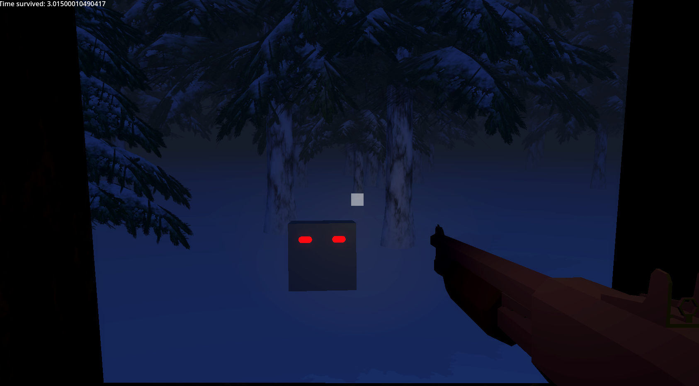

# Solstice

<!-- TABLE OF CONTENTS -->

  
Table of Contents

  <ol>
	<a href="#about-the-project">About The Project</a>
	<li><a href="#built-with">Built With</a></li>
	</ul>
	<li><a href="#play">How to play?</a></li>
	<li><a href="#tutorial">If you're stuck, a tutorial</a></li>
	<li><a href="#roadmap">Roadmap</a></li>
	<li><a href="#license">License</a></li>
	<li><a href="#contact">Contact</a></li>
	<li><a href="#acknowledgments">Acknowledgments</a></li>
  </ol>

<!-- ABOUT THE PROJECT -->
## About The Project

### Overall
Siege W13. Unlucky number, but the theme being Winter is amazing. Still, brainstorming was hard. I wasn't able to get 10 hours fully, unfortunately, but Im still proud of what I was able to do. The enemy and the death screen are rushed, but alas. Survive the night!!

Siege W15 Back again because my friend said this was almost peak!! Going to add to the readme what I want to get done

### What even is this?
You're in a cabin, staring out into the winter day. Pick up a few calls, and watch the sun set. It's the winter solstice, and there's a long night ahead. Stay awake, stay alert, and make it past... the Solstice.
* First person controller
* Cabin, gun, forest, and monster models
* Nighttime environment
* Enemies to shoot
* Monster is animated
* Sparks on wherever you hit
* Death once enemies get to your window

### What do I take out of this?
Don't procrastinate... I had hours which I wasted, and now Ive an unfinished game. Dang.

(<a href="#readme-top">back to top</a>)

### Screenshots
They’re fairly large, so I’ve tucked them into expandable sections:

  
<strong>Screenshot of an enemy staring riht at you</strong>

  

#### Notes
- 

> [!TIP]  
> Press `B` to release the mouse!
 

(<a href="#readme-top">back to top</a>)
 

### Built With

This section should list any major frameworks/libraries used to bootstrap your project.

* Godot 4.5.1

(<a href="#readme-top">back to top</a>)

### Play 

If you'd like to build it yourself, I used Godot 4.5. I do have a pre-built web version available [here on my itch](https://pixelsaver.itch.io/just-u-and-i), but if you still insist on building this unoptimized mess, go ahead.

1. Install Godot 4.5
2. Download and unzip the code
3. Open the file with Godot project manager
4. Go to Project > Export, add whichever platform you're on (MacOS, Windows) and then click export.
5. You're good to go!

#### Tutorial
If you're stuck, I have left a list of hints below to help you out :)

(<a href="#readme-top">back to top</a>)

<!-- ROADMAP -->
## Roadmap

- [ ] Open and close the window
  - [ ] Window model and animations
  - [ ] Add two windows to manage them
- [ ] Pick up calls
  - [ ] Dialogue and options for calls
- [X] Winter environment
  - [ ] Day / Sunset / Night atmosphere
  - [X] Trees 
  - [X] Fog
  - [ ] Snowstorm
- [X] Gun 
  - [ ] Shoot anim sounds crosshair
  - [X] Low poly model
  - [ ] Add a low battery flashlight to illuminate but have it run out of battery
- [ ] Sounds for things
  - [ ] Gun Sounds
  - [ ] Window sounds
  - [ ] Monster sounds
  - [ ] Winter sounds
- [X] Enemies show up and creep closer
  - [X] Model or just a pair of eyes if no time 

(<a href="#readme-top">back to top</a>)

<!-- LICENSE -->
## License

Distributed under the MIT License. See `LICENSE` for more information.

(<a href="#readme-top">back to top</a>)

<!-- CONTACT -->
## Contact

Pixel Saver - [itch.io](https://pixelsaver.itch.io/) 

Project Link: [https://github.com/PixelSaver/Solstice](https://github.com/PixelSaver/Solstice)

(<a href="#readme-top">back to top</a>)

<!-- ACKNOWLEDGMENTS -->
## Acknowledgments

Many thanks for these people for letting me use their work for free!

* "Scandinavian Log Cabin" (https://skfb.ly/pBJuN) by rivetech is licensed under Creative Commons Attribution (http://creativecommons.org/licenses/by/4.0/).
* "The fir - winter and summer" (https://skfb.ly/6zEXR) by LadyIReyna is licensed under Creative Commons Attribution-NonCommercial (http://creativecommons.org/licenses/by-nc/4.0/).
* "Low Poly Mossberg 590" (https://skfb.ly/oYDLJ) by Monnapse is licensed under Creative Commons Attribution (http://creativecommons.org/licenses/by/4.0/).
* "Wendigo - Low Poly" (https://skfb.ly/pr6Tz) by NECROMON is licensed under Creative Commons Attribution (http://creativecommons.org/licenses/by/4.0/).

 
<!--
* [Choose an Open Source License](https://choosealicense.com)
* [GitHub Emoji Cheat Sheet](https://www.webpagefx.com/tools/emoji-cheat-sheet)
* [Malven's Flexbox Cheatsheet](https://flexbox.malven.co/)
* [Malven's Grid Cheatsheet](https://grid.malven.co/)
* [Img Shields](https://shields.io)
* [GitHub Pages](https://pages.github.com)
* [Font Awesome](https://fontawesome.com)
* [React Icons](https://react-icons.github.io/react-icons/search)
-->

(<a href="#readme-top">back to top</a>)

